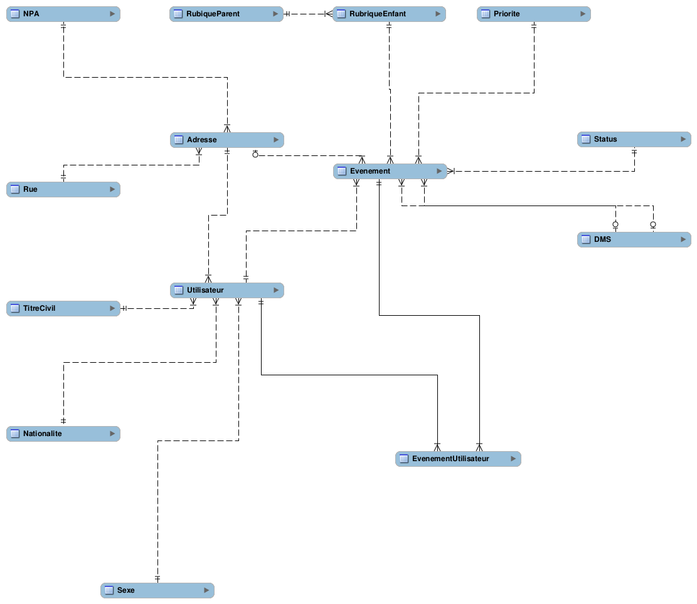

# Cahier des charges - __Smartcity__

Auteurs : Camilo __Pineda Serna__, Jérémie __Zanone__, Loan __Lassalle__, Luana __Martelli__, Tano __Iannetta__ et
Wojciech __Myszkorowski__

## 1 But du projet
Notre projet a pour but de faciliter la gestion d'évènements officiels et de référencer des requêtes de citoyens au sein de la ville de Lausanne. Une carte interactive permettra d'avoir un aperçu clair des différentes localisations se rapportant aux requêtes. L'application pourra générer un rapport au format PDF permettant un suivi des évènements.

## 2 Description du projet
Nous voulons implémenter une application permettant à l'administration d'une ville (dans notre cas Lausanne) d'organiser les requêtes (de réparations, d'évènements, de projet, etc.) venant de ses citoyens. Les administrateurs de l'application pourront ajouter des évènements officiels.
Chaque requête devra être validée par un administrateur et ajoutée à une rubrique dédiée. Il sera ensuite possible de consulter ces différentes rubriques et de visualiser, au moyen d'une carte interactive, les endroits concernés. Pour une meilleure visibilité, chaque rubrique sera associée à un filtre, rendant ainsi plus aisée la lecture de la carte. Il sera aussi possible pour l'administrateur de donner des priorités aux évènements (haute ou à titre informatif) afin de traiter plus efficacement les requêtes. L'administrateur pourra aussi consulter la carte selon une date précise. Finalement, l'administrateur pourra générer des PDF contenant des informations relatives aux évènements et aux rubriques qu'il aura précédemment choisies.

## 3 Modèle conceptuel de données

*Figure 1 - Schéma EA de la base de donnée*

Ce diagramme présente les entités de notre projet. Au centre, l'entité __Evenement__ représente les requêtes à administrer. Les évènements :
* appartiennent à une __RubriqueEnfant__.
	* ces dernières peuvent être regroupées en des __RubriqueParent__.  
* concernent une __Adresse__, mais surtout deux coordonnées __DMS__ (degré-minute-seconde) pour la latitude et la longitude.
	* ces coordonnées seront employées afin de visualiser l'évènement sur la carte interactive.   
* disposent d'un __Statut__.  
* possèdent une __Priorité__.    
* sont proposés par des __Utilisateurs__.    
Ils peuvent également être accompagnés de __commentaires__.

## 4 Fonctionnalités
### Fonctionnalités principales  

#### 4.1 Gestion, dans une base de données, de toutes les requêtes remontées par les citoyens    
* Les requêtes appartiendront à une rubrique (accidents, évènements, doléances, etc.)  
* L'administrateur de l'application pourra gérer les rubriques.
* Un évènement aura une priorité donnée par l'administrateur.

#### 4.2 Gestion d'un agenda  
* Pour toutes les requêtes, chacune aura une date de création et dans la mesure du possible une date de fin estimée.
* Organisation de la carte selon les filtres des rubriques et de la date (granularité au jour principalement).

#### 4.3 Gestion des requêtes faites par les utilisateurs  
Les utilisateurs de l'application pourront effectuer plusieurs types de requêtes, classées selon les rubriques suivantes:

* Traffic
	* Accidents
	* Travaux
* Chantier
	* Constructions
	* Rénovations
* Culture
	* Manifestations
* Doléances

#### 4.4 Filtrage des requêtes
L'administrateur s'occupera de filtrer les requêtes faites par les utilisateurs. Pour certains comptes privilégiés, il n'y aura pas besoin de l'intervention de l'administrateur.

* Gestion des évènements (acceptation de requêtes, refus)
* Comptes privilégiés (par exemple, les accidents proposés par les TCS sont directement validés)

#### 4.5 Ajout d’évènements de la ville

Les utilisateurs pourront émettre une localisation d'une nouvelle manifestation qui sera approuvée ou non par l’administrateur.

### 4.7 Implémentation d'une carte interactive
L'application comportera une carte interactive avec laquelle il sera possible d'interagir. Cette carte référencera à l'aide de "tags" les événements ayant lieu dans la ville

* Affichage interactif de la carte (zoom, déplacement manuel)
* Ajout de différentes icônes (pins) sur la carte pour localiser les différents types d'événements
* Filtre des événements par date et par rubriques

### 4.8 Génération d'un PDF
* Génération d'un PDF selon une rubrique choisie
* Ces PDF seront principalement destinés aux départements reliés aux rubriques, afin de garder un historique des événements. On peut imaginer qu'une fois générés, ils seront envoyés aux personnes concernées.
* Un PDF sera organisé en deux parties
	* La première partie sera commune à tous les types de rubriques et contiendra les informations principales (nom de la rubrique, nom de l'événement, lieu, date, priorité et texte détaillant l'événement)
	* La deuxième partie sera présentée sous la forme de statistiques. Elles seront personnalisées selon la rubrique. Par exemple, s'il s'agit d'un événement relatif à des travaux, on affichera le temps moyen de la durée des chantiers. S'il s'agit en revanche de doléances, on affichera plutôt le nombre de commentaires qui ont été publiés à ce sujet, et ainsi de suite pour les autres rubriques.
* Si plusieurs filtres ont été sélectionnés, alors une option sera de générer automatiquement plusieurs PDF.

### Fonctionnalités supplémentaires (suivant possibilité)    

* Gestion de plusieurs comptes administrateurs
* Dessins et coloriages sur la carte selon des critères de secteurs (cercles, lignes, texte).  
* Ajout d'une capture d'écran dans le PDF de l'état de la carte.
* Calcul de chemin le plus court en évitant les zones accidentées ou en travaux.  

### Fonctionnalité future

 * Application client mobile
 	* Ajout d'un filtre à spam pour supprimer les messages non désirés ou restreindre le nombre de requêtes par citoyen sur une période de temps. Ainsi qu'un contrôle de grossièretés.  

## 5 Description de l'interface graphique

La fenêtre principale sera composée:

- En haut, un menu permettant d'ajouter des évènements, apporter des modifications, générer un fichier PDF ainsi qu'une modération des évènements (requêtes) en attente de validation reçus des citoyens avec un compteur (notification). Chacune de ces fonctionnalités sera gérée dans une autre fenêtre.

- Sur la gauche, les différentes rubriques (filtres) organisées de la manière suivante:
    - Traffic
        - Accidents
        - Travaux
    - Culture
        - Manifestations
    - Chantiers
        - Rénovations
        - Constructions
    - Doléances

     Elles pourront être cochées afin de visualiser les détails au centre de la fenêtre, d’apparaître sur la carte sous forme de _pin_ ainsi que de déterminer les informations lors de la génération du PDF.

- Sur la droite, la carte composée de tuiles fournies par OpenStreetMap (OSM) liée à un calendrier pour le filtrage des événements sur le plan temporel.

## 6 Contraintes et exigences envers le système
L'application produite doit être fonctionnelle sur les machines Windows. Si possible, elle devra être exécutable depuis un CD/DVD.  

La machine exécutant le programme devra être dotée d'au moins 4GO de RAM ainsi que d'un processeur de 5e génération afin de garantir un fonctionnement fluide de l'application. Il sera nécessaire d'avoir un accès à Internet afin d'avoir accès aux tuiles OSM de la carte.  

## 7 Planning prévisionnel

* L'Administration s'est faite au début du projet avec l'attribution du chef de projet M. Iannetta ainsi que la formation du groupe.  
* Le Dossier de projet se fera tout au long du projet afin de documenter et d'expliquer les différentes fonctionnalités et décisions prises tout au long du projet.
* L'Analyse	a été faite en même temps que le cahier des charges et se fera encore lors du début de la conception et lors de la prise en main des premières difficultés qui apparaîtront.
* La Conception	sera une des grandes parties du projet qui va nous occuper environ 7 semaines.
* La Réalisation		
* Les tests se feront le plus tôt possible, mais nous espérons avoir 10 jours avant le rendu pour finaliser et tester notre projet.
* La documentation sera faite pour tout le code et faite par nos soins.
* Le rendu se fera le 30 mai 2017

## 8 Organisation

Nous nous sommes réparties le travail en tâches qui étaient les plus indépendantes possible, malgré le fait que dans un projet comme celui-ci, il arrive vite que deux tâches se regroupent. Nous avons donc ajouté des tâches de liaison entre les différentes fonctionnalités afin de ne pas sous-estimer le travail de mise en commun entre deux tâches différentes.

## 9 Annexe

* Schéma de Gantt
